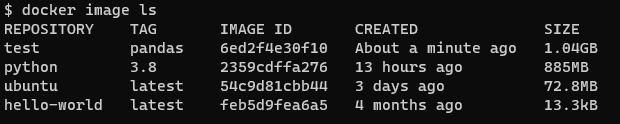
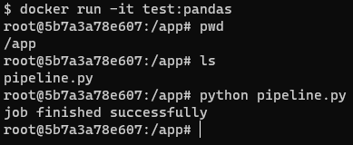
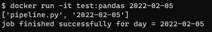
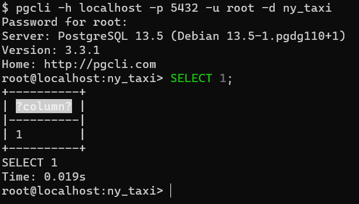

# Docker and PostgreSQL

### Table of Contents
- [Introduction to Docker](#introduction-to-docker)
  - [Why docker?](#why-docker)
  - [Creating a simple data pipeline in docker](#creating-a-simple-data-pipeline-in-docker)
- [Ingest Data into Postgres Running Locally in Docker](#ingest-data-into-postgres-running-locally-in-docker)
  - [Run postgres locally with Docker](#run-postgres-locally-with-docker)
  - [Query the database using `pgcli`](#query-the-database-using-pgcli)
  - [Ingest the data to the database](#ingest-the-data-to-the-database)
- [Connecting Postgres and pgAdmin with Docker network](#connecting-postgres-and-pgadmin-with-docker-network)

# Introduction to Docker

__Docker__ is a platform as a serivce products that use OS-level virtualization to deliver software in packages called *containers* similar to virtual machines but lighter in resource consumption. Each of these containers bundle the software, libraries, and configuration files so that they are isolated from one another.

A __Docker image__ is a *snapshot* of a container that we can define to run our software, or in this case our data pipelines. By exporting our Docker images to Cloud providers such as Amazon Web Services or Google Cloud Platform we can run our containers there.

In our use case, lets say we have a data pipeline, we want to run this data pipeline in a docker container so that this data pipeline is isolated from the rest.

[Images here showing basic flow of data pipeline]

To run this pipeline on our host computer (windows) and to achieve isolation, we can use docker. A simple architecture to illustrate:

[Images here showing the architecture]

Each of those blocks (containers) are self contained, and they will have everything that the particular service needs such as the software, configurations, and library dependencies in it.

<br>

## Why docker?

* Reproducibility
    * Docker containers are __stateless__. Any changes done inside a container will __NOT__ be saved when the container is killed and started again. This is an advantage because it allows us to restore any container to its initial state in a *reproducible* manner, but you will have to store data elsewhere if you need to do so; a common way to do so is with volumes.
* Local experiments
* Integration tests (CI/CD)
* Running pipelines on the cloud (AWS Batch, Kubernetes jobs)
* Spark (Analytics enginer for large-scale data processing)
* Serverless (AWS Lambda)

<br>

## Creating a simple data pipeline in Docker

To get started we can try to run the following command to verify docker is working:

```
docker run hello-world
```

this command will first look for a Docker image called `hello-world` from the local repository. If it doesn't exist, then it will try to pull (download) it from the Docker Hub, which is a cloud-based repository for container images.

Once the command container is started it will print a Hello World message on the CLI.

We can also add parameters to the command for example:

```
docker run -it ubuntu bash
```

the flag `-it` means that we want to run the container *interactively*, and we want to execute/run `bash` on the `ubuntu` docker image.

Once the container starts it will give us access to a bash prompt inside the container.

Now lets create a simple `Dockerfile` which is used to build our Docker image.

```dockerfile
# base image that we will build on
FROM python:3.8

# run commands to install dependencies for our pipelines
RUN pip install pandas

# set bash as the entrypoint to give us a bash prompt instead of python prompt
ENTRYPOINT [ "bash" ]
```

Now lets build the image

```
docker build -t test:pandas .
```

Check if the image was built

```
docker image ls
```

We should see that the image is successfully built on the repository `test` tagged `pandas`



Now lets run the container

```
docker run -it test:pandas
```

Verify that pandas is installed by running the command `python` on the bash prompt to open up a python prompt and then run

```python
import pandas
pandas.__version__
```

Now lets create the baseline for our pipeline script. `pipeline.py`

```python
import pandas as pd

# do stuff with pandas

print ('job finished successfully')
```

Next modify the Dockerfile

```dockerfile
FROM python:3.8

RUN pip install pandas

# set the working directory inside the container
WORKDIR /app

# copy the script to the container, 1st is source file, 2nd is destination
COPY pipeline.py pipeline.py

ENTRYPOINT [ "bash" ]
```

Now rebuild the image with the same command above and rerun the container. Finally, test the container.



For a data pipeline our container need to be self sufficient, instead of opening python prompt everytime we want to test our pipeline. Some modifications are in order to the `pipeline.py` script and `Dockerfile`

```python
import sys
import pandas # not actually used yet but keep it atm

# print arguments
print(sys.argv)

# argument 0 is the name of the file
# argumment 1 contains the actual first argument we care about
day = sys.argv[1]

# cool pandas stuff goes here

# print a sentence with the argument
print(f'job finished successfully for day = {day}')
```

Running this script with `python pipeline.py <some_number>` will print out:

* `['pipeline.py', '<some_number>']`
* `job finished succesfully for day = <some_number>`

Next is to modify the `Dockerfile` to containerize the script:

```dockerfile
FROM python:3.8

RUN pip install pandas

WORKDIR /app
COPY pipeline.py pipeline.py

# instead of starting the container with bash prompt,
# we straight up just run the script.
ENTRYPOINT [ "python", "pipeline.py" ]
```

Next lets rebuild the image and run the container with additional argument `<some_number>`, lets say `2022-02-05`

```
docker run -it test:pandas 2022-02-05
```



</br>

# Ingest Data into Postgres Running Locally in Docker

In this part we will try to ingest data [NY Taxi dataset](https://s3.amazonaws.com/nyc-tlc/trip+data/yellow_tripdata_2021-01.csv) into postgres running on Docker.

</br>

## Run postgres locally with Docker

To run a containerized version of postgres, there is a need to provide *environment variables* and *volume* for storing data to the container.

```
docker run -it \
    -e POSTGRES_USER="root" \
    -e POSTGRES_PASSWORD="root" \
    -e POSTGRES_DB="ny_taxi" \
    -v $(pwd)/ny_taxi_postgres_data:/var/lib/postgresql/data \
    -p 5432:5432 \
    postgres:13
```

* The flag `-e` set up environment variables for the container. There are 3 environment variables set here:
    * `POSTGRES_USER` is the username to log into the database.
    * `POSTGRES_PASSWORD` is the password for the database. Note that these values are __STRICTLY__ for development purposes only.
    * `POSTGRES_DB` is the name for the database/schema.

* The flag `-v` mount a volume directory to the container. The colon `:` separates the path for the host computer (before colon), and inside the container (after).
    * Note: Path names must be absolute. In UNIX-like system, we can use `pwd` to print the local folder and use that as a shortcut.
    * This command will only work if run from a directory which contains the `ny_taxi_postgres_data` subdirectory created above.

* The flag `-p` is for port mapping. The default Postgres port is mapped to the same port in the host computer.
    * Note: If you have a running Postgres instance in your host computer and it uses the default Postgres port, then the Postgres container will need to use a different port to map to.

* The last argument is the image name `postgres` and tag, denoting the version `13`

Once the container is running, we can query the database using `pgcli`.

</br>

## Query the database using `pgcli`

First of all run the command

```
pip install pgcli
```

to install (if not installed yet) command line interface for Postgres which we are going to use to query our database with.

Next run the command

```
pgcli -h localhost -p 5432 -u root -d ny_taxi
```

* The flag `-h` is to specify the host. Since this DB is run locally, we use localhost.
* The flag `-p` is the port.
* The flag `-u` is the username to log into the DB.
    * Note that the password is not provided here, but it will be prompted after running the command.
* The flag `-d` is the database name.

Once successfully connected to the database, we can verify our installation by running a simple query `SELECT 1;`



</br>

## Ingest the data to the database

To get started, first we will download data from the [NYC TLC Trip Record Data website](https://www1.nyc.gov/site/tlc/about/tlc-trip-record-data.page). We will use the records of [Yellow taxi trip for January 2021](https://s3.amazonaws.com/nyc-tlc/trip+data/yellow_tripdata_2021-01.csv). 

```
wget https://s3.amazonaws.com/nyc-tlc/trip+data/yellow_tripdata_2021-01.csv
```

The description of each column in the dataset is available [here](https://www1.nyc.gov/assets/tlc/downloads/pdf/data_dictionary_trip_records_yellow.pdf).

Next we will use jupyter notebook and pandas to explore the data on the notebook `upload-data.ipynb`.

The details on the exploration of the data is on the [notebook](upload-data.ipynb).

</br>

# Connecting Postgres and pgAdmin with Docker network

To connect with postgres db, other than using `pgcli`, we can also use `pgAdmin`. It is more convenient because it's a web-based GUI that makes acessing and managing the databases easier.

