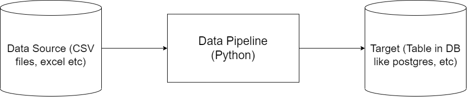
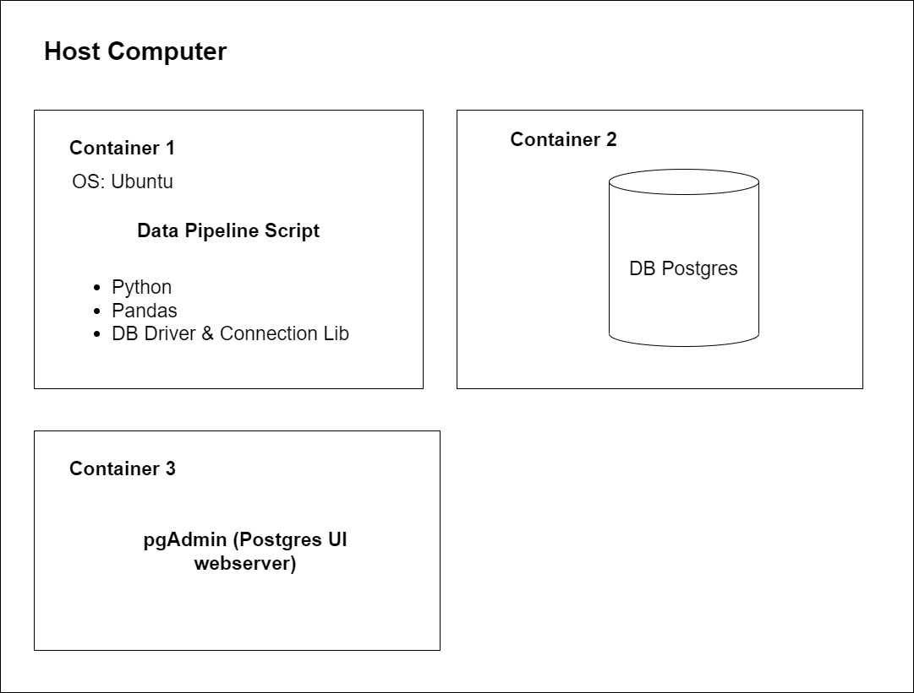

# Docker and PostgreSQL

### Table of Contents
- [Introduction to Docker](#introduction-to-docker)
  - [Why docker?](#why-docker)
  - [Creating a simple data pipeline in docker](#creating-a-simple-data-pipeline-in-docker)
- [Ingest Data into Postgres Running Locally in Docker](#ingest-data-into-postgres-running-locally-in-docker)
  - [Run postgres locally with Docker](#run-postgres-locally-with-docker)
  - [Query the database using `pgcli`](#query-the-database-using-pgcli)
  - [Ingest the data to the database](#ingest-the-data-to-the-database)
- [Connecting Postgres and pgAdmin with Docker network](#connecting-postgres-and-pgadmin-with-docker-network)
  - [Installing and configuring pgAdmin in Docker](#installing-and-configuring-pgadmin-in-docker)
  - [Docker Networks](#docker-networks)
- [Putting the ingestion script to Docker](#putting-the-ingestion-script-to-docker)
  - [Converting an ipynb notebook to a Python script](#converting-an-ipynb-notebook-to-a-python-script)
  - [Parametrizing the script with `argparse`](#parametrizing-the-script-with-argparse)
  - [Dockerizing the ingestion script](#dockerizing-the-ingestion-script)
    - [Optional: HTTP server + ipconfig](#optional-http-server--ipconfig)
- [Running postgres and pgAdmin with `docker-compose`](#running-postgres-and-pgadmin-with-docker-compose)
  - [Why `docker-compose`](#why-docker-compose)
  - [Docker-compose YAML file](#docker-compose-yaml-files)
  - [Running multiple containers with `docker-compose up`](#running-multiple-containers-with-docker-compose-up)
- [SQL Refresher](#sql-refresher)
  - [Adding the zone tables](#adding-the-zone-tables)
  - [Basic query and INNER JOIN](#basic-query-and-inner-join)
  - [Basic data quality checks](#basic-data-quality-checks)
  - [LEFT, RIGHT, and OUTER JOIN](#left-right-and-outer-join)
  - [Dealing with date-like columns and GROUP BY](#dealing-with-date-like-columns-and-group-by)


# Introduction to Docker

__Docker__ is a platform as a serivce products that use OS-level virtualization to deliver software in packages called *containers* similar to virtual machines but lighter in resource consumption. Each of these containers bundle the software, libraries, and configuration files so that they are isolated from one another.

A __Docker image__ is a *snapshot* of a container that we can define to run our software, or in this case our data pipelines. By exporting our Docker images to Cloud providers such as Amazon Web Services or Google Cloud Platform we can run our containers there.

In our use case, lets say we have a data pipeline, we want to run this data pipeline in a docker container so that this data pipeline is isolated from the rest.



To run this pipeline on our host computer (windows) and to achieve isolation, we can use docker. A simple architecture to illustrate:



Each of those blocks (containers) are self contained, and they will have everything that the particular service needs such as the software, configurations, and library dependencies in it.

<br>

## Why docker?

* Reproducibility
    * Docker containers are __stateless__. Any changes done inside a container will __NOT__ be saved when the container is killed and started again. This is an advantage because it allows us to restore any container to its initial state in a *reproducible* manner, but you will have to store data elsewhere if you need to do so; a common way to do so is with volumes.
* Local experiments
* Integration tests (CI/CD)
* Running pipelines on the cloud (AWS Batch, Kubernetes jobs)
* Spark (Analytics enginer for large-scale data processing)
* Serverless (AWS Lambda)

<br>

## Creating a simple data pipeline in Docker

To get started we can try to run the following command to verify docker is working:

```
docker run hello-world
```

this command will first look for a Docker image called `hello-world` from the local repository. If it doesn't exist, then it will try to pull (download) it from the Docker Hub, which is a cloud-based repository for container images.

Once the command container is started it will print a Hello World message on the CLI.

We can also add parameters to the command for example:

```
docker run -it ubuntu bash
```

the flag `-it` means that we want to run the container *interactively*, and we want to execute/run `bash` on the `ubuntu` docker image.

Once the container starts it will give us access to a bash prompt inside the container.

Now lets create a simple `Dockerfile` which is used to build our Docker image.

```dockerfile
# base image that we will build on
FROM python:3.8

# run commands to install dependencies for our pipelines
RUN pip install pandas

# set bash as the entrypoint to give us a bash prompt instead of python prompt
ENTRYPOINT [ "bash" ]
```

Now lets build the image

```
docker build -t test:pandas .
```

Check if the image was built

```
docker image ls
```

We should see that the image is successfully built on the repository `test` tagged `pandas`


Now lets run the container

```
docker run -it test:pandas
```

Verify that pandas is installed by running the command `python` on the bash prompt to open up a python prompt and then run

```python
import pandas
pandas.__version__
```

Now lets create the baseline for our pipeline script. `pipeline.py`

```python
import pandas as pd

# do stuff with pandas

print ('job finished successfully')
```

Next modify the Dockerfile

```dockerfile
FROM python:3.8

RUN pip install pandas

# set the working directory inside the container
WORKDIR /app

# copy the script to the container, 1st is source file, 2nd is destination
COPY pipeline.py pipeline.py

ENTRYPOINT [ "bash" ]
```

Now rebuild the image with the same command above and rerun the container. Finally, test the container.


For a data pipeline our container need to be self sufficient, instead of opening python prompt everytime we want to test our pipeline. Some modifications are in order to the `pipeline.py` script and `Dockerfile`

```python
import sys
import pandas # not actually used yet but keep it atm

# print arguments
print(sys.argv)

# argument 0 is the name of the file
# argumment 1 contains the actual first argument we care about
day = sys.argv[1]

# cool pandas stuff goes here

# print a sentence with the argument
print(f'job finished successfully for day = {day}')
```

Running this script with `python pipeline.py <some_number>` will print out:

* `['pipeline.py', '<some_number>']`
* `job finished succesfully for day = <some_number>`

Next is to modify the `Dockerfile` to containerize the script:

```dockerfile
FROM python:3.8

RUN pip install pandas

WORKDIR /app
COPY pipeline.py pipeline.py

# instead of starting the container with bash prompt,
# we straight up just run the script.
ENTRYPOINT [ "python", "pipeline.py" ]
```

Next lets rebuild the image and run the container with additional argument `<some_number>`, lets say `2022-02-05`

```
docker run -it test:pandas 2022-02-05
```


</br>

# Ingest Data into Postgres Running Locally in Docker

In this part we will try to ingest data [NY Taxi dataset](https://s3.amazonaws.com/nyc-tlc/trip+data/yellow_tripdata_2021-01.csv) into postgres running on Docker.

</br>

## Run postgres locally with Docker

To run a containerized version of postgres, there is a need to provide *environment variables* and *volume* for storing data to the container.

```
docker run -it \
    -e POSTGRES_USER="root" \
    -e POSTGRES_PASSWORD="root" \
    -e POSTGRES_DB="ny_taxi" \
    -v $(pwd)/ny_taxi_postgres_data:/var/lib/postgresql/data \
    -p 5432:5432 \
    postgres:13
```

* The flag `-e` set up environment variables for the container. There are 3 environment variables set here:
    * `POSTGRES_USER` is the username to log into the database.
    * `POSTGRES_PASSWORD` is the password for the database. Note that these values are __STRICTLY__ for development purposes only.
    * `POSTGRES_DB` is the name for the database/schema.

* The flag `-v` mount a volume directory to the container. The colon `:` separates the path for the host computer (before colon), and inside the container (after).
    * Note: Path names must be absolute. In UNIX-like system, we can use `pwd` to print the local folder and use that as a shortcut.
    * This command will only work if run from a directory which contains the `ny_taxi_postgres_data` subdirectory created above.

* The flag `-p` is for port mapping. The default Postgres port is mapped to the same port in the host computer.
    * Note: If you have a running Postgres instance in your host computer and it uses the default Postgres port, then the Postgres container will need to use a different port to map to.

* The last argument is the image name `postgres` and tag, denoting the version `13`

Once the container is running, we can query the database using `pgcli`.

</br>

## Query the database using `pgcli`

First of all run the command

```
pip install pgcli
```

to install (if not installed yet) command line interface for Postgres which we are going to use to query our database with.

Next run the command

```
pgcli -h localhost -p 5432 -u root -d ny_taxi
```

* The flag `-h` is to specify the host. Since this DB is run locally, we use localhost.
* The flag `-p` is the port.
* The flag `-u` is the username to log into the DB.
    * Note that the password is not provided here, but it will be prompted after running the command.
* The flag `-d` is the database name.

Once successfully connected to the database, we can verify our installation by running a simple query `SELECT 1;`


</br>

## Ingest the data to the database

To get started, first we will download data from the [NYC TLC Trip Record Data website](https://www1.nyc.gov/site/tlc/about/tlc-trip-record-data.page). We will use the records of [Yellow taxi trip for January 2021](https://s3.amazonaws.com/nyc-tlc/trip+data/yellow_tripdata_2021-01.csv). 

```
wget https://s3.amazonaws.com/nyc-tlc/trip+data/yellow_tripdata_2021-01.csv
```

The description of each column in the dataset is available [here](https://www1.nyc.gov/assets/tlc/downloads/pdf/data_dictionary_trip_records_yellow.pdf).

Next we will use jupyter notebook and pandas to explore the data on the notebook `upload-data.ipynb`.

The details on the exploration of the data is on the [notebook](upload-data.ipynb).

</br>

# Connecting Postgres and pgAdmin with Docker network

To connect with postgres db, other than using `pgcli`, we can also use `pgAdmin`. It is more convenient because it's a web-based GUI that makes acessing and managing the databases easier.

First let's try installing `pgAdmin` with __Docker__.

</br>

## Installing and configuring pgAdmin in Docker

Run the command

```
docker run -it \
    -e PGADMIN_DEFAULT_EMAIL="admin@admin.com" \
    -e PGADMIN_DEFAULT_PASSWORD="root" \
    -p 8080:80 \
    dpage/pgadmin4
```

>Note: the env values used here are __STRICTLY__ for development purpose only.

The parameter `dpage/pgadmin4` is taken from the official pgAdmin image in Docker Hub `docker pull dpage/pgadmin4`.

After the container starts, access pgAdmin through `localhost:8080`. We should be prompted with a login page, login using the same parameter set above.

Now we need to add new Server for pgAdmin to interact with. Right-click on *Servers* on the left sidebar and then select *Create -> Server*


Now under General tab, fill in the Server name, then under Connection tab, fill it with the same values we used for our postgres container.


Now it seems we encountered an error, that we cannot connect to `localhost:5432`. This makes sense because we are running pgAdmin on a *separate* container with our Postgres container. 

The term `localhost` here is pointing to the local network __INSIDE__ the container, therefore it looks for Postgres inside the pgAdmin container, and since it doesn't exist, it throws an error.

To make pgAdmin be able to find our Postgres database, there are two solutions:

* Run both pgAdmin and Postgres inside the same container
* Link both container by putting them inside the same network interface using Docker Networks.

In our use case, we will proceed with the latter option.

</br>

## Docker Networks

Docker Network allows us to create a *virtual network* interface for our containers so that each containers can communicate with each other.

First of all, let's try creating a docker network by running the following command:

```
docker network create pg-network
```

>To remove a network we can use `docker network rm <network-name>` and to see list of existing networks we use `docker network ls`.

Once our network is created, we need to modify our Postgres container to run on that network, we also need to give it a name, in this case, `pg-database`, so that our pgAdmin container can find it.

```
docker run -it \
    -e POSTGRES_USER="root" \
    -e POSTGRES_PASSWORD="root" \
    -e POSTGRES_DB="ny_taxi" \
    -v $(pwd)/ny_taxi_postgres_data:/var/lib/postgresql/data \
    -p 5432:5432 \
    --network=pg-network \
    --name pg-database \
    postgres:13
```

Once we started our Postgres container, try logging in with `pgcli` first and run a simple count row query to verify if our data persisted.

Next, let's run our pgAdmin container on the same network

```
docker run -it \
    -e PGADMIN_DEFAULT_EMAIL="admin@admin.com" \
    -e PGADMIN_DEFAULT_PASSWORD="root" \
    -p 8080:80 \
    --network=pg-network \
    --name pgadmin \
    dpage/pgadmin4
```

Once the container starts, let's repeat configuration the process for pgadmin in [previous part](#installing-and-configuring-pgadmin-in-docker). This time, under Connection tab, fill in the host with our Postgres container name, in this case, `pg-database`


See on the left sidebar that we have successfully connected with our postgres DB, we can also perform query the database like selecting the first 100 rows.


</br>

# Putting the ingestion script to Docker

## Converting an ipynb notebook to a Python script

We will now try to dockerize our ingestion script that was written in Jupyter Notebook before. We can start by exporting the file as a Python script using the following command:

```
jupyter nbconvert --to=script upload-data.ipynb
```

After converting it, we need to clean the script by removing the unnecessary texts such as the markdown cells, redundant command, etc. Also rename the file to `ingest-data.py`.

</br>

## Parametrizing the script with `argparse`

Next is to use `argparse` library from the Python standard library to parametrize our script in the command line. Final script is in [ingest-data.py](ingest-data.py)

In order to test the script, we need to drop the table we have created before. Using the query tool on pgAdmin, run:

```sql
DROP TABLE yellow_taxi_data;
```

Now we can run our script with the following command:

```
python ingest-data.py \
    --user=root \
    --password=root \
    --host=localhost \
    --port=5432 \
    --db=ny_taxi \
    --table_name=yellow_taxi_trips \
    --url="https://s3.amazonaws.com/nyc-tlc/trip+data/yellow_tripdata_2021-01.csv"
```

Verify through pgAdmin that the ingestion worked


Last step is to dockerize our ingestion script.

</br>

## Dockerizing the ingestion script

Start by modifying the [Dockerfile we created before](#creating-a-simple-data-pipeline-in-docker).

```dockerfile
FROM python:3.8

# Need to install wget so we can download the csv
RUN apt-get install wget
# sqlalchemy needs psycopg2 to create postgres connection engine
RUN pip install pandas sqlalchemy psycopg2

WORKDIR /app
COPY ingest-data.py ingest-data.py

ENTRYPOINT [ "python", "ingest-data.py" ]
```

Build the image

```
docker build -t taxi_ingest:0.0.1 .
```

>Verify the image exists in local repo with `docker images`

Then run it

```
docker run -it \
    --network=pg-network \
    taxi_ingest:0.0.1 \
    --user=root \
    --password=root \
    --host=pg-database \
    --port=5432 \
    --db=ny_taxi \
    --table_name=yellow_taxi_trips \
    --url="https://s3.amazonaws.com/nyc-tlc/trip+data/yellow_tripdata_2021-01.csv"
```

* We need to provide the network for Docker to find the Postgres container. It goes before the name of the image.
* Since Postgres is running on a separate container, the host argument will have to point to the container name of Postgres.
* The script already replace the existing table automatically so there is no need to drop the table beforehand.

### Optional: HTTP server + ipconfig

Optionally if downloads of the CSV data is slow, since we have already downloaded the file before we can start http server using python

```
python -m http.server
```

then we can access `localhost:8000` to check what it is


We can't use localhost for our dockerized script since it this localhost is pointing to our host machine, so let's use `ipconfig` to get the ip so that our container can connect.

Look up the IPv4 Address of the section Ethernet Adapter, such that the URL of the http server is now `172.xxx.xxx.x:8000`.

>replace `x`'s with whatever value you shown.

Now simply replace the URL part in the docker run command with

```
docker run -it \
    --network=pg-network \
    taxi_ingest:0.0.1 \
    --user=root \
    --password=root \
    --host=pg-database \
    --port=5432 \
    --db=ny_taxi \
    --table_name=yellow_taxi_trips \
    --url="http://172.xxx.xxx.x:8000/yellow_tripdata_2021-01.csv"
```

</br>

# Running postgres and pgAdmin with `docker-compose`

Previously we have multiple container created for this architecture, but we had to run each container individually one-by-one. Fortunately, there is a way to run multiple containers simultaneously with `docker-compose`.

</br>

## Why `docker-compose`

`docker-compose` allows us to launch multiple containers using a single configuration file. This way, we don't need to run multiple `docker run` manually each time we want to deploy our architecture.

Another advantage is that we don't have to specify a network because `docker-compose` already takes care of it. Every container will automatically run within the same network interface and able to communicate with each other.

Docker compose use YAML file as a configuration file to run multiple containers.

</br>

## Docker compose YAML files

We can specify multiple containers as *'services'* in our YAML file. Let's start creating one containing both postgres and pgAdmin.

```yaml
services:
    pgdatabase:
        image: postgres:13
        environment:
            - POSTGRES_USER=root
            - POSTGRES_PASSWORD=root
            - POSTGRES_DB=ny_taxi
        volumes:
            - "./ny_taxi_postgres_data:/var/lib/postgresql/data:rw"
        ports:
            - "5432:5432"

    pgadmin:
        image: dpage/pgadmin4
        environment:
            - PGADMIN_DEFAULT_EMAIL=admin@admin.com
            - PGADMIN_DEFAULT_PASSWORD=root
        volumes:
            - "./data_pgadmin:/var/lib/pgadmin"
        ports:
            - "8080:80"
```

* `image` is the docker image we will be building our container from.
* `environment`, `volumes`, and `ports` work like the respective flag in `docker run`.
* Note that we added `volume` to pgadmin, this is so that the settings for pgAdmin is preserved. Make sure to create the directory `data_pgadmin` beforehand.

</br>

## Running multiple containers with `docker-compose up`

Now let's start our container using

```
docker-compose up
```

>Note that this command works if we are currently in the same directory the `docker-compose.yaml` file is located in. The mounted volumes are also assumed to be in the same directory.

Since we didn't mount a volume for pgAdmin before, we need to re-create the connection, the step is the same [before](#installing-and-configuring-pgadmin-in-docker).

To shut down the containers, run:

```
docker-compose down
```

To run the containers in the background, run:

```
docker-compose up -d
```

The flag `-d` runs the container in detached mode.

>To run our dockerized data ingestion script, we need to find the network created by `docker-compose`. Simply use `docker network ls` to find it and then change the network parameter in `docker run`

</br>

# SQL refresher

For this section, we are going to work with 2 tables, `yellow_taxi_trips` and `taxi_zones` table, and perform some SQL queries.

>For a more detailed look into SQL, check out [this article](https://towardsdatascience.com/sql-in-a-nutshell-part-1-basic-real-world-scenarios-33a25ba8d220).

</br>

## Adding the zone tables

Refer to [homework](../homework/README.md)

## Basic query and `INNER JOIN `

The following queries encompasses the basics of SQL query and also the usage of `INNER JOIN`.

```sql
SELECT
    *
FROM
    yellow_taxi_trips
LIMIT 100;
```
* Selects all rows in the `yellow_taxi_trips` table. If there are more than 100 rows, select only the first 100.

```sql
SELECT
    *
FROM
    yellow_taxi_trips t,
    taxi_zones zpu,
    taxi_zones zdo
WHERE
    t."PULocationID" = zpu."LocationID" AND
    t."DOLocationID" = zdo."LocationID"
LIMIT 100;
```
* Selects all rows in the `yellow_taxi_trips` table. If there are more than 100 rows, select only the first 100.
* We give aliases to the `yellow_taxi_trips` and `taxi_zones` tables for easier access.
* We replace the IDs inside `PULocationID` and `DOLocationID` with the actual zone IDs for pick ups and drop offs.
* We use double quotes (`""`) for the column names because in Postgres we need to use them if the column names contains capital letters.

```sql
SELECT
    tpep_pickup_datetime,
    tpep_dropoff_datetime,
    total_amount,
    CONCAT(zpu."Borough", '/', zpu."Zone") AS "pickup_loc",
    CONCAT(zdo."Borough", '/', zdo."Zone") AS "dropoff_loc"
FROM
    yellow_taxi_trips t,
    taxi_zones zpu,
    taxi_zones zdo
WHERE
    t."PULocationID" = zpu."LocationID" AND
    t."DOLocationID" = zdo."LocationID"
LIMIT 100;
```
* Same as previous but instead of the complete rows we only display specific columns.
* We make use of ***joins*** (_implicit joins_ in this case) to display combined info as a single column.
    * The new "virtual" column `pickup_loc` contains the values of both `Borough` and `Zone` columns of the `taxi_zones` table, separated by a slash (`/`).
    * Same for `dropoff_loc`.
* More specifically this is an ***inner join***, because we only select the rows that overlap between the 2 tables.
* Learn more about SQL joins [here](https://dataschool.com/how-to-teach-people-sql/sql-join-types-explained-visually/) and [here](https://www.wikiwand.com/en/Join_(SQL)).

```sql
SELECT
    tpep_pickup_datetime,
    tpep_dropoff_datetime,
    total_amount,
    CONCAT(zpu."Borough", '/', zpu."Zone") AS "pickup_loc",
    CONCAT(zdo."Borough", '/', zdo."Zone") AS "dropoff_loc"
FROM
    yellow_taxi_trips t JOIN taxi_zones zpu
        ON t."PULocationID" = zpu."LocationID"
    JOIN taxi_zones zdo
        ON t."DOLocationID" = zdo."LocationID"
LIMIT 100;
```
* Exactly the same statement as before but rewritten using explicit `JOIN` keywords.
    * Explicit inner joins are preferred over implicit inner joins.
* The `JOIN` keyword is used after the `FROM` statement rather than the `WHERE` statement. The `WHERE` statement is actually unneeded.
    ```sql
    SELECT whatever_columns FROM table_1 JOIN table_2_with_a_matching_column ON column_from_1=column_from_2
    ```
* You can also use the keyword `INNER JOIN` for clarity.
* Learn more about SQL joins [here](https://dataschool.com/how-to-teach-people-sql/sql-join-types-explained-visually/) and [here](https://www.wikiwand.com/en/Join_(SQL)).

</br>

## Basic data quality checks

The following queries are about data checks.

```sql
SELECT
    tpep_pickup_datetime,
    tpep_dropoff_datetime,
    total_amount,
    "PULocationID",
    "DOLocationID"
FROM
    yellow_taxi_trips t
WHERE
    "PULocationID" is NULL
LIMIT 100;
```
* Selects rows from the `yellow_taxi_trips` table whose pick up location is null and displays specific columns.
* If you have not modified the original tables, this query should return an empty list.

```sql
SELECT
    tpep_pickup_datetime,
    tpep_dropoff_datetime,
    total_amount,
    "PULocationID",
    "DOLocationID"
FROM
    yellow_taxi_trips t
WHERE
    "DOLocationID" NOT IN (
        SELECT "LocationID" FROM taxi_zones
    )
LIMIT 100;
```
* Selects rows fromn the `yellow_taxi_trips` table whose drop off location ID does not appear in the `taxi_zones` table.
* If you did not modify any rows in the original datasets, the query would return an empty list.

```sql
DELETE FROM taxi_zones WHERE "LocationID" = 142;
```
* Deletes all rows in the `taxi_zones` table with `LocationID` of 142.
* If we were to run this query and then run the previous query, we would get a list of rows with `PULocationID` of 142.

</br>

## LEFT, RIGHT, and `OUTER JOIN`

```sql
SELECT
    tpep_pickup_datetime,
    tpep_dropoff_datetime,
    total_amount,
    CONCAT(zpu."Borough", '/', zpu."Zone") AS "pickup_loc",
    CONCAT(zdo."Borough", '/', zdo."Zone") AS "dropoff_loc"
FROM
    yellow_taxi_trips t LEFT JOIN taxi_zones zpu
        ON t."PULocationID" = zpu."LocationID"
    LEFT JOIN taxi_zones zdo
        ON t."DOLocationID" = zdo."LocationID"
LIMIT 100;
```
* Similar to the join query from before but we use a ***left join*** instead.
* ***Left joins*** shows all rows from the "left" part of the statement but only the rows from the "right" part that overlap with the "left" part, thus the name.
* This join is useful if we deleted one of the `LocationID` rows like before. The inner join would omit some rows from the `yellow_taxi_trips` table, but this query will show all rows. However, since one ID is missing, the "virtual" columns we defined to transform location ID's to actual names will appear with empty strings if the query cannot find the location ID.
* Learn more about SQL joins [here](https://dataschool.com/how-to-teach-people-sql/sql-join-types-explained-visually/) and [here](https://www.wikiwand.com/en/Join_(SQL)).

</br>

## Dealing with date-like columns and `GROUP BY`.

The following queries shows us how to deal with date, datetime, and timestamp type of columns. Additionally, there are also queries involving `GROUP BY` for aggregation.

```sql
SELECT
    tpep_pickup_datetime,
    tpep_dropoff_datetime,
    DATE_TRUNC('DAY', tpep_pickup_datetime),
    total_amount,
FROM
    yellow_taxi_trips t
LIMIT 100;
```
* Selects all rows from the `yellow_taxi_trips` table but displays specific columns.
* `DATE_TRUNC` is a function that trunctates a timestamp. When using `DAY` as a parameter, it removes any smaller values (hours, minutes, seconds) and displays them as `00:00:00` instead.

```sql
SELECT
    tpep_pickup_datetime,
    tpep_dropoff_datetime,
    CAST(tpep_pickup_datetime AS DATE) as "day",
    total_amount,
FROM
    yellow_taxi_trips t
LIMIT 100;
```
* Very similar to previous query, but instead it casts the `TIMESTAMP` type to `DATE`, so that the hours:minutes:seconds info is completely omitted rather than show as `00:00:00`. The columns will be displayed under the name `day`.

```sql
SELECT
    CAST(tpep_pickup_datetime AS DATE) as "day",
    COUNT(1)
FROM
    yellow_taxi_trips t
GROUP BY
    CAST(tpep_pickup_datetime AS DATE)
ORDER BY "day" ASC;
```
* Counts the amount of records in the `yellow_taxi_trips` table grouped by day.
* We remove the limit of 100 records because we do not want to restrict the amount of info on screen.
* Grouping does not guarantee order, so we enforce that the rows will be displayed in ascending order from earliest to latest day.

```sql
SELECT
    CAST(tpep_pickup_datetime AS DATE) as "day",
    COUNT(1) as "count",
    MAX(total_amount),
    MAX(passenger_count)
FROM
    yellow_taxi_trips t
GROUP BY
    CAST(tpep_pickup_datetime AS DATE)
ORDER BY "count" DESC;
```
* Similar to the previous query but orders the rows by count and displays them in descending order, so that the day with the highest amount of yellow_taxi_trips is shown first.
* We also show the maximum amount that a driver earned in a trip for that day and the maximum passenger count on a single trip for that day.

```sql
SELECT
    CAST(tpep_pickup_datetime AS DATE) as "day",
    "DOLocationID",
    COUNT(1) as "count",
    MAX(total_amount),
    MAX(passenger_count)
FROM
    yellow_taxi_trips t
GROUP BY
    1, 2
ORDER BY "count" DESC;
```
* Similar to previous but we also include the drop off location column and we group by it as well, so that each row contains the amount of yellow_taxi_trips for that location by day.
* Instead of having to repeat the same line in both the `SELECT` and `GROUP BY` parts, we can simply indicate the arguments we use after the `SELECT` keyword by order number.
    * SQL is 1-indexed. The first argument is 1, not 0.

```sql
SELECT
    CAST(tpep_pickup_datetime AS DATE) as "day",
    "DOLocationID",
    COUNT(1) as "count",
    MAX(total_amount),
    MAX(passenger_count)
FROM
    yellow_taxi_trips t
GROUP BY
    1, 2
ORDER BY
    "day" ASC,
    "DOLocationID" ASC;
```
* Similar to previous query but we now order by ascending order both by day and then drop off location ID, both in ascending order.

As a final note, SQL commands can be categorized into the following categories:
* ***DDL***: Data Definition Language.
    * Define the database schema (create, modify, destroy)
    * `CREATE`, `DROP`, `ALTER`, `TRUNCATE`, `COMMENT`, `RENAME`
* ***DQL***: Data Query Language.
    * Perform queries on the data within schema objects. Get data from the database and impose order upon it.
    * `SELECT`
* ***DML***: Data Manipulation Language.
    * Manipulates data present in the database.
    * `INSERT`, `UPDATE`, `DELETE`, `LOCK`...
* ***DCL***: Data Control Language.
    * Rights, permissions and other controls of the database system.
    * Usually grouped with DML commands.
    * `GRANT`, `REVOKE`
* ***TCL***: Transaction Control Language.
    * Transactions within the database.
    * Not a universally considered category.
    * `COMMIT`, `ROLLBACK`, `SAVEPOINT`, `SET TRANSACTION`