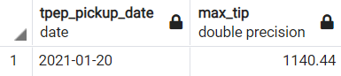
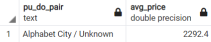

# Homework Solution for Week 1

### Table of Contents
- [Question 1](#question-1)
    - [Q1 Solution](#q1-solution)
- [Question 2](#question-2)
    - [Q2 Solution](#q2-solution)
- [Question 3](#question-3)
    - [Q3 Solution](#q3-solution)
- [Question 4](#question-4)
    - [Q4 Solution](#q4-solution)
- [Question 5](#question-5)
    - [Q5 Solution](#q5-solution)
- [Question 6](#question-6)
    - [Q6 Solution](#q6-solution)

# Question 1

### Google Cloud SDK

* Install Google Cloud SDK. What's the version you have?

### Google Cloud account

* Create an account in Google Cloud and create a project

## Q1 Solution

### Google Cloud SDK

* Running the command `gcloud --version` gives:

    ```
    Google Cloud SDK 371.0.0
    bq 2.0.73
    core 2022.01.28
    gsutil 5.6
    ```

### Google Cloud Account

* This step is already done through the learning process. Please refer to the [notes](../terraform-gcp/README.md).

</br>

# Question 2

### Terraform

* After installing terraform, navigate to the directory of `Week_1_Basics_And_Setups/terraform-gcp`, then run the commands below and copy the output:

    * `terraform init`
    * `terraform plan`
    * `terraform apply`

### Prepare Postgres

* Run postgres and load the following data:

    * [Yellow Taxi Trips Data](https://s3.amazonaws.com/nyc-tlc/trip+data/yellow_tripdata_2021-01.csv)
    * [Zone data](https://s3.amazonaws.com/nyc-tlc/misc/taxi+_zone_lookup.csv)

## Q2 Solution

### Terraform

* Running `terraform init`,

    ```
    Initializing the backend...

    Initializing provider plugins...
    - Reusing previous version of hashicorp/google from the dependency lock file
    - Using previously-installed hashicorp/google v4.9.0

    Terraform has been successfully initialized!

    You may now begin working with Terraform. Try running "terraform plan" to see
    any changes that are required for your infrastructure. All Terraform commands
    should now work.

    If you ever set or change modules or backend configuration for Terraform,
    rerun this command to reinitialize your working directory. If you forget, other
    commands will detect it and remind you to do so if necessary.
    ```

    Then running `terraform plan`,

    ```
    var.project
    Your GCP Project ID

    Enter a value: data-engineering-340515


    Terraform used the selected providers to generate the following execution plan. Resource actions are indicated with the following symbols:
    + create

    Terraform will perform the following actions:

    # google_bigquery_dataset.dataset will be created
    + resource "google_bigquery_dataset" "dataset" {
        + creation_time              = (known after apply)
        + dataset_id                 = "trips_data_all"
        + delete_contents_on_destroy = false
        + etag                       = (known after apply)
        + id                         = (known after apply)
        + last_modified_time         = (known after apply)
        + location                   = "us-west1"
        + project                    = "data-engineering-340515"
        + self_link                  = (known after apply)

        + access {
            + domain         = (known after apply)
            + group_by_email = (known after apply)
            + role           = (known after apply)
            + special_group  = (known after apply)
            + user_by_email  = (known after apply)

            + view {
                + dataset_id = (known after apply)
                + project_id = (known after apply)
                + table_id   = (known after apply)
                }
            }
        }

    # google_storage_bucket.data-lake-bucket will be created
    + resource "google_storage_bucket" "data-lake-bucket" {
        + force_destroy               = true
        + id                          = (known after apply)
        + location                    = "US-WEST1"
        + name                        = "dtc_data_lake_data-engineering-340515"
        + project                     = (known after apply)
        + self_link                   = (known after apply)
        + storage_class               = "STANDARD"
        + uniform_bucket_level_access = true
        + url                         = (known after apply)

        + lifecycle_rule {
            + action {
                + type = "Delete"
                }

            + condition {
                + age                   = 30
                + matches_storage_class = []
                + with_state            = (known after apply)
                }
            }

        + versioning {
            + enabled = true
            }
        }

    Plan: 2 to add, 0 to change, 0 to destroy.

    ─────────────────────────────────────────────────────────────────────────────────────────────────────────────────────────────────────────────────────────────────────────

    Note: You didn't use the -out option to save this plan, so Terraform can't guarantee to take exactly these actions if you run "terraform apply" now.
    ```

    Finally, running `terraform apply`,

    ```
    var.project
    Your GCP Project ID

    Enter a value: data-engineering-340515


    Terraform used the selected providers to generate the following execution plan. Resource actions are indicated with the following symbols:
    + create

    Terraform will perform the following actions:

    # google_bigquery_dataset.dataset will be created
    + resource "google_bigquery_dataset" "dataset" {
        + creation_time              = (known after apply)
        + dataset_id                 = "trips_data_all"
        + delete_contents_on_destroy = false
        + etag                       = (known after apply)
        + id                         = (known after apply)
        + last_modified_time         = (known after apply)
        + location                   = "us-west1"
        + project                    = "data-engineering-340515"
        + self_link                  = (known after apply)

        + access {
            + domain         = (known after apply)
            + group_by_email = (known after apply)
            + role           = (known after apply)
            + special_group  = (known after apply)
            + user_by_email  = (known after apply)

            + view {
                + dataset_id = (known after apply)
                + project_id = (known after apply)
                + table_id   = (known after apply)
                }
            }
        }

    # google_storage_bucket.data-lake-bucket will be created
    + resource "google_storage_bucket" "data-lake-bucket" {
        + force_destroy               = true
        + id                          = (known after apply)
        + location                    = "US-WEST1"
        + name                        = "dtc_data_lake_data-engineering-340515"
        + project                     = (known after apply)
        + self_link                   = (known after apply)
        + storage_class               = "STANDARD"
        + uniform_bucket_level_access = true
        + url                         = (known after apply)

        + lifecycle_rule {
            + action {
                + type = "Delete"
                }

            + condition {
                + age                   = 30
                + matches_storage_class = []
                + with_state            = (known after apply)
                }
            }

        + versioning {
            + enabled = true
            }
        }

    Plan: 2 to add, 0 to change, 0 to destroy.

    Do you want to perform these actions?
    Terraform will perform the actions described above.
    Only 'yes' will be accepted to approve.

    Enter a value: yes

    google_bigquery_dataset.dataset: Creating...
    google_storage_bucket.data-lake-bucket: Creating...
    google_bigquery_dataset.dataset: Creation complete after 2s [id=projects/data-engineering-340515/datasets/trips_data_all]
    google_storage_bucket.data-lake-bucket: Creation complete after 3s [id=dtc_data_lake_data-engineering-340515]

    Apply complete! Resources: 2 added, 0 changed, 0 destroyed.
    ```

### Prepare Postgres

Yellow Taxi data has already been loaded through the learning process, please refer to the [notes](../docker-sql/README.md).

To load the taxi zone data, first lets run the docker container by running

```
docker-compose up -d
```

Next modify the previous ingestion script to include zone data, refer to [Dockerfile](./Dockerfile) and [ingestion script](./ingest-data.py).

After that build the image:

```
docker build -t taxi_ingest:0.0.2 .
```

Then run the following command:

```
docker run -it \
    --network=docker-sql_default \
    taxi_ingest:0.0.2 \
    --user=root \
    --password=root \
    --host=pgdatabase \
    --port=5432 \
    --db=ny_taxi \
    --table_name1=yellow_taxi_trips \
    --table_name2=taxi_zones
```

Next, verify that the ingestion is successful through pgadmin


</br>

# Question 3

### Count records

How many taxi trips were there on January 15?

Consider only trips that started on January 15.

## Q3 Solution

On pgAdmin, run the following query

```sql
SELECT COUNT(*)
FROM yellow_taxi_trips
WHERE DATE(tpep_pickup_datetime) = '2021-01-15';
```


The proposed query for solution:

```sql
select count(*)
from yellow_taxi_trips
where tpep_pickup_datetime::date = '2021-01-15'
```

</br>

# Question 4

### Largest tip for each day

Find the largest tip for each day. On which day it was the largest tip in January?

Use the pick up time for your calculations.

## Q4 Solution

On pgAdmin, run the following query

```sql
SELECT 
	DATE(tpep_pickup_datetime) AS tpep_pickup_date,
	MAX(tip_amount) AS max_tip
FROM yellow_taxi_trips
GROUP BY tpep_pickup_date
ORDER BY max_tip DESC
LIMIT 1;
```



Removing the clause `LIMIT 1` will give the largest tip for each day.

The proposed query for solution:

```sql
select date_trunc('day', tpep_pickup_datetime) as pickup_day,
  max(tip_amount) as max_tip
from yellow_taxi_trips
group by pickup_day
order by max_tip desc
limit 1;
```

</br>

# Question 5

### Most popular destination

What was the most popular destination for passengers picked up in central park on January 14?

Use the pick up time for your calculations.

Enter the zone name (not id). If the zone name is unknown (missing), write "Unknown"

## Q5 Solution

On pgAdmin, run the following

```sql
SELECT
	COALESCE("Zone", 'Unknown') AS "Zone",
	COUNT(*) AS destination_count
FROM taxi_zones
RIGHT JOIN (
	SELECT
		DATE(tpep_pickup_datetime) AS pickup_date,
		"DOLocationID"
	FROM yellow_taxi_trips
	WHERE
		DATE(tpep_pickup_datetime) = '2021-01-14'
	AND
		"PULocationID" = (
			SELECT "LocationID"
			FROM taxi_zones
			WHERE "Zone" = 'Central Park'
	)
) trip ON trip."DOLocationID" = taxi_zones."LocationID"
GROUP BY "Zone"
ORDER BY destination_count DESC
LIMIT 1;
```


The proposed query for solution:

```sql
select coalesce(dozones."Zone",'Unknown') as zone,
count(*) as cant_trips
from yellow_taxi_trips as taxi
  inner join taxi_zones as puzones
    on taxi."PULocationId" = puzones."LocationId"
  left join taxi_zones as dozones
    on taxi."DOLocationID" = dozones."LocationID"
where puzones."Zone" ilike '%central park%'
  and tpep_pickup_datetime::date = '2021-01-14'
group by 1
order by cant_trips desc
limit 1;
```

</br>

# Question 6

### Most expensive locations

What's the pickup-dropoff pair with the largest average price for a ride (calculated based on total_amount)?

Enter two zone names separated by a slash

For example:

"Jamaica Bay / Clinton East"

If any of the zone names are unknown (missing), write "Unknown". For example, "Unknown / Clinton East".

## Q6 Solution

On pgAdmin run the following query

```sql
SELECT
	CONCAT(pu_zone, ' / ', COALESCE(zone_do."Zone", 'Unknown')) AS pu_do_pair,
	AVG(total_amount) AS avg_price
FROM (
	SELECT
		COALESCE("Zone", 'Unknown') AS pu_zone,
		"DOLocationID" AS do_id,
		total_amount
	FROM yellow_taxi_trips
	LEFT JOIN taxi_zones ON "PULocationID" = "LocationID"
) trip
LEFT JOIN taxi_zones zone_do ON trip.do_id = zone_do."LocationID"
GROUP BY pu_do_pair
ORDER BY avg_price DESC
LIMIT 1;
```



The proposed query for the solution:

```sql
select concat(coalesce(puzones."Zone",'Unknown'), '/', coalesce(dozones."Zone",'Unknown')) as pickup_dropoff,
  avg(total_amount) as avg_price_ride
from yellow_taxi_trips as taxi
  left join taxi_zones as puzones
    on taxi."PULocationID" = puzones."LocationID"
  left join taxi_zones as dozones
    on taxi."DOLocationID" = dozones."LocationID"
group by 1
order by avg_price_ride desc
limit 1;
```