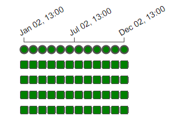

# Homework Solution for Week 2

### Table of Contents
- [Question 1](#question-1)
    - [Q1 Solution](#q1-solution)
- [Question 2](#question-2)
    - [Q2 Solution](#q2-solution)
- [Question 3](#question-3)
    - [Q3 Solution](#q3-solution)
- [Question 4](#question-4)
    - [Q4 Solution](#q4-solution)
- [Question 5](#question-5)
    - [Q5 Solution](#q5-solution)
- [Question 6](#question-6)
    - [Q6 Solution](#q6-solution)

# Question 1

### Start date for the Yellow taxi data (1 point)

* You'll need to parametrize the DAG for processing the yellow taxi data that
we created in the videos. 

    What should be the start date for this dag?

    * 2019-01-01
    * 2020-01-01
    * 2021-01-01
    * days_ago(1)

## Q1 Solution

The task is to ingest NY Taxi data from 2019 and 2020 to the data lake, so the start date is:

```
2019-01-01
```

refer to [this file](./homework_q1_q2.py) for the complete dag.

</br>

# Question 2

### Frequency for the Yellow taxi data (1 point)

* How often do we need to run this DAG?
    * Daily
    * Monthly
    * Yearly
    * Once

## Q2 Solution

Since the files are categorized by month, the frequency should be:

```
Monthly
```

The logical/execution date does not relate to the actual current date. When we set it to monthly, the DAG will run once per "logical" month, but we can run all available months at once.

</br>

# Question 3

### DAG for FHV Data (2 points)

* Now create another DAG - for uploading the FHV data.

    We will need three steps:

    * Download the data
    * Parquetize it
    * Upload to GCS

    If you don't have a GCP account, for local ingestion you'll need two steps:

    * Download the data
    * Ingest to Postgres

    Use the same frequency and the start date as for the yellow taxi dataset

* __Question__: how many DAG runs are green for data in 2019 after finishing everything?

    Note: when processing the data for 2020-01 you probably will get an error. It's up to you to decide what to do with it - for Week 3 homework we won't need 2020 data.

## Q3 Solution

Refer to [this](./homework_q3.py) for the DAG.

As for how many runs are green, there are 12 runs in total as seen below



</br>

# Question 4

### DAG for Zones (2 points)

* Create the final DAG - for Zones:

    * Download it
    * Parquetize
    * Upload to GCS
    * (Or two steps for local ingestion: download -> ingest to postgres)

* How often does it need to run?

    * Daily
    * Monthly
    * Yearly
    * Once

## Q4 Solution

Refer to [this](./homework_q4.py) for the DAG.

It only needs to be run __Once__ since there is only 1 file.

</br>

# Solution Files

Here is the proposed solution [file](./solution.py).
